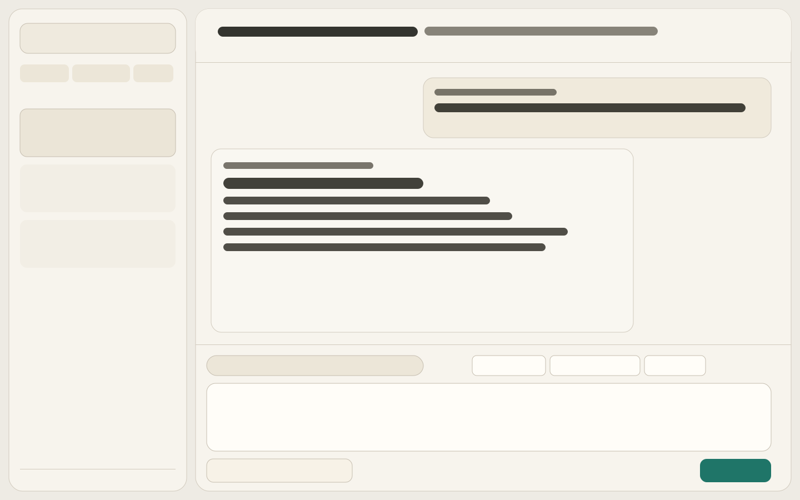
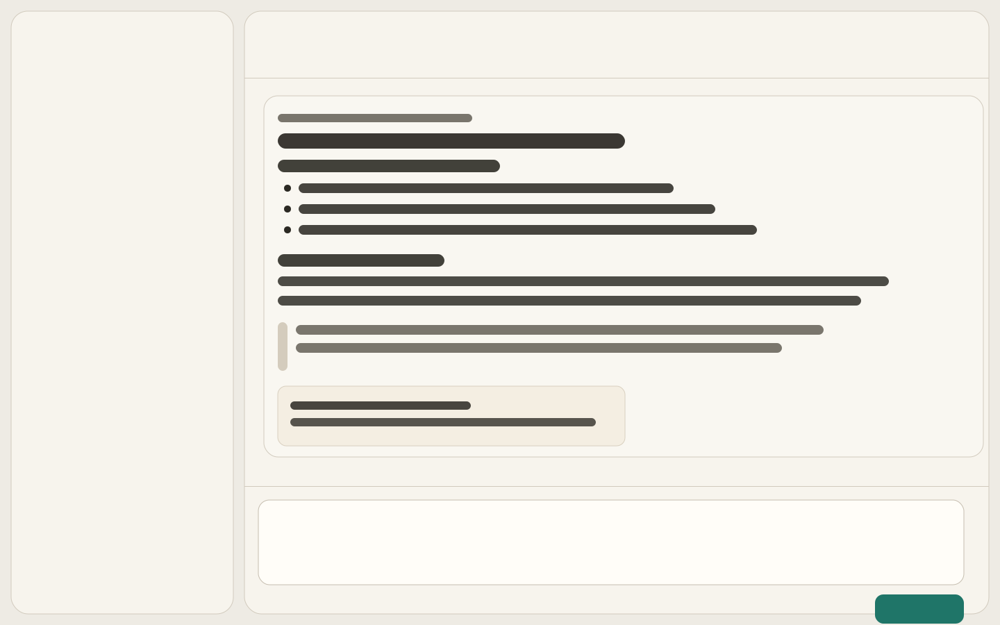
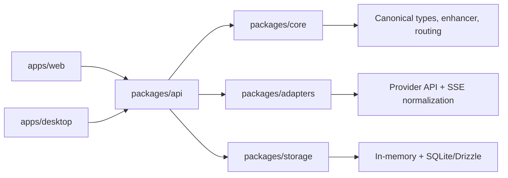

# Aggreate AI Prompt Enhancer

[](https://github.com/Ejteel/aggreate-ai-prompt-enhancer/actions/workflows/ci.yml)

Local-first desktop + web workspace for multi-provider AI conversations with prompt enhancement, canonical thread state, and provider/model switching.

## Quick Start (5 minutes)
```bash
git clone https://github.com/Ejteel/aggreate-ai-prompt-enhancer.git
cd aggreate-ai-prompt-enhancer
npm run setup
cp .env.example .env.local
npm run -w @mvp/web dev
```
Open `http://localhost:3001`.

## Local Restart Guide (Mac + PC)
- Simple run/restart troubleshooting: [docs/LOCAL_RUNBOOK_MAC_WINDOWS.md](docs/LOCAL_RUNBOOK_MAC_WINDOWS.md)

## PRD
- In-repo PRD (Markdown): [docs/PRODUCT_REQUIREMENTS_DOCUMENT.md](docs/PRODUCT_REQUIREMENTS_DOCUMENT.md)
- PRD (Word): [docs/PRODUCT_REQUIREMENTS_DOCUMENT.docx](docs/PRODUCT_REQUIREMENTS_DOCUMENT.docx)

## Expected UI Baseline
- Conversation layout: 
- Markdown rendering state: 

## Current Capabilities
- Unified chat UI for OpenAI, Anthropic, and Gemini.
- Prompt enhancement toggle per message.
- Transformed prompt preview for transparency.
- Assistant markdown rendering (`react-markdown` + `remark-gfm`).
- Local-first architecture with shared core, adapters, API orchestration, and storage packages.

## Architecture (Where To Edit What)


## Monorepo Layout
- `apps/web`: Next.js chat app UI and API route fallback.
- `apps/admin`: Next.js control plane for multi-application admin/RBAC/runtime controls.
- `apps/desktop`: Electron shell + preload bridge.
- `packages/core`: Canonical types, enhancer, routing.
- `packages/adapters`: Provider integrations and SSE parsing.
- `packages/api`: Chat orchestration services/contracts.
- `packages/storage`: In-memory + SQLite/Drizzle repositories.
- `docs`: Product documentation (including PRD).

## Requirements
- Node.js 20+
- npm 10+

## Setup
```bash
npm run setup
```

Set API keys before calling providers:
- `OPENAI_API_KEY`
- `ANTHROPIC_API_KEY`
- `GEMINI_API_KEY`

## Privacy and Safe Demo Modes
### 1) Demo mode (no real AI calls)
Set this before starting web server:
```bash
DEMO_MODE=true
```
In demo mode, `/api/chat` returns structured mock responses and does not use any provider API key.

### 2) Private access mode selector
Choose one mode:
```bash
PRIVATE_AUTH_MODE=none   # no auth
PRIVATE_AUTH_MODE=basic  # shared HTTP Basic Auth
PRIVATE_AUTH_MODE=hybrid # Basic Auth + OAuth
PRIVATE_AUTH_MODE=oauth  # GitHub and/or Google OAuth (real user accounts)
```

### 3) Basic Auth gate
For `PRIVATE_AUTH_MODE=basic`:
```bash
PRIVATE_AUTH_USERNAME=your_username
PRIVATE_AUTH_PASSWORD=your_strong_password
```

### 4) OAuth login gate (recommended)
For `PRIVATE_AUTH_MODE=oauth`:
```bash
AUTH_SECRET=long_random_secret
# or use NEXTAUTH_SECRET (same purpose)
NEXTAUTH_SECRET=long_random_secret
NEXTAUTH_URL=https://your-deployed-domain.com
AUTH_GITHUB_ID=github_oauth_app_client_id
AUTH_GITHUB_SECRET=github_oauth_app_client_secret
AUTH_GOOGLE_ID=google_oauth_client_id
AUTH_GOOGLE_SECRET=google_oauth_client_secret
```
Users can open the public demo at `/workspace` without login, while private access goes through `/login` and redirects to `/private-workspace`. If users have 2FA enabled in GitHub/Google accounts, that 2FA is enforced by the identity provider during sign-in.

Optional allowlist for private pilot access:
```bash
ALLOWED_EMAILS=founder@company.com,advisor@gmail.com
ALLOWED_DOMAINS=company.com,partner.org
```
If both are empty, any authenticated OAuth user is allowed.

### 5) Optional control-plane runtime mode
For runtime mode managed by a separate admin app:
```bash
CONTROL_PLANE_SETTINGS_URL=https://admin.your-domain.com/api/settings
CONTROL_PLANE_APP_ID=aggregator-web
CONTROL_PLANE_SERVICE_TOKEN=long_random_shared_token
```
Or force a mode directly:
```bash
APP_RUNTIME_MODE=demo
# or
APP_RUNTIME_MODE=private_live
```

## Vercel Deployment (Secure Defaults)
Use one Vercel project with environment-specific variables:

- `Preview` environment: protected private environment
- `Production` environment: either protected live app or public demo

`PRIVATE_AUTH_MODE` behavior:
- If set, uses your explicit value.
- If unset on Vercel:
  - defaults to `oauth`
  - defaults to `none` only when `DEMO_MODE=true` and `PUBLIC_DEMO=true`

Deployment matrix:

| Scenario | Env vars |
|---|---|
| Private access (recommended) | `PRIVATE_AUTH_MODE=oauth`, `AUTH_SECRET`, `NEXTAUTH_URL`, and at least one provider pair: (`AUTH_GITHUB_ID` + `AUTH_GITHUB_SECRET`) or (`AUTH_GOOGLE_ID` + `AUTH_GOOGLE_SECRET`) |
| Private production | same as Private access, plus provider API keys |
| Public safe demo | `DEMO_MODE=true`, `PUBLIC_DEMO=true`, leave provider keys unset |

For full step-by-step setup, see [docs/DEPLOYMENT_VERCEL.md](docs/DEPLOYMENT_VERCEL.md).
For shared admin/control-plane setup, see [docs/ADMIN_CONTROL_PLANE.md](docs/ADMIN_CONTROL_PLANE.md).

## Run
Web app:
```bash
npm run -w @mvp/web dev
```

Admin app:
```bash
npm run -w @mvp/admin dev
```

Desktop app loop:
```bash
npm run dev
```

## Build and Test
```bash
npm run build
npm run typecheck
npm test
```
Browser smoke tests (Playwright):
```bash
npm run test:e2e
```
Local smoke run (requires local web/admin servers):
```bash
npm run test:e2e:local
```

Pilot UX/QA protocol:
- [docs/PILOT_UX_QA_PROTOCOL.md](docs/PILOT_UX_QA_PROTOCOL.md)

## Troubleshooting
- `Safari can’t connect to localhost:3001`
  - Ensure dev server is running: `npm run -w @mvp/web dev`
- CSS looks unstyled/default HTML
  - Hard refresh (`Cmd+Option+R`) and disable content blockers for localhost.
  - If needed: `rm -rf apps/web/.next && npm run -w @mvp/web dev`
- Port conflict on 3001
  - Find process: `lsof -nP -iTCP:3001 -sTCP:LISTEN`
  - Stop conflicting process or change web port in `apps/web/package.json`.
- Provider calls fail
  - Verify keys with: `npm run doctor`
  - Or run without keys using `DEMO_MODE=true`

## Execution Workflow
Use GitHub issue templates to execute PRD scope:
- `Feature Request` for new product capabilities.
- `Roadmap Task` for implementation units tied to PRD sections/milestones.
- `Bug Report` for regressions and quality issues.

## Notes
- Never commit API keys or secrets.
- If a key is exposed, rotate it immediately.

