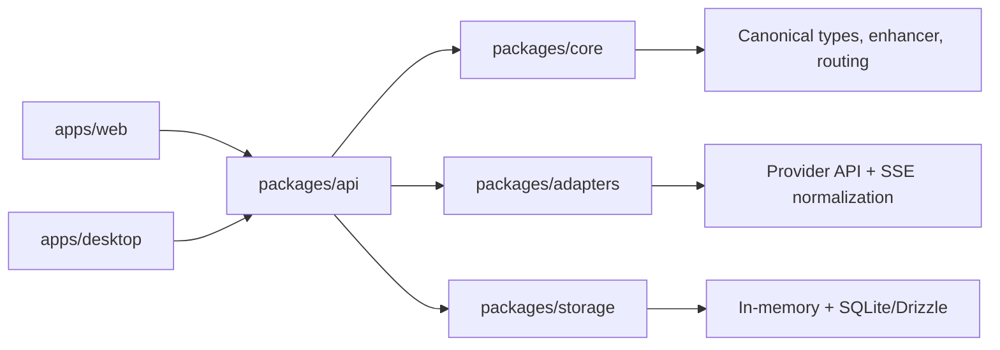

# Aggreate AI Prompt Enhancer

[](https://github.com/Ejteel/aggreate-ai-prompt-enhancer/actions/workflows/ci.yml)

Local-first desktop + web workspace for multi-provider AI conversations with prompt enhancement, canonical thread state, and provider/model switching.

## Quick Start (5 minutes)
```bash
git clone https://github.com/Ejteel/aggreate-ai-prompt-enhancer.git
cd aggreate-ai-prompt-enhancer
npm run setup
cp .env.example .env.local
npm run -w @mvp/web dev
```
Open `http://localhost:3001`.

## PRD
- In-repo PRD (Markdown): [docs/PRODUCT_REQUIREMENTS_DOCUMENT.md](docs/PRODUCT_REQUIREMENTS_DOCUMENT.md)
- PRD (Word): [docs/PRODUCT_REQUIREMENTS_DOCUMENT.docx](docs/PRODUCT_REQUIREMENTS_DOCUMENT.docx)

## Expected UI Baseline
- Conversation layout: 
- Markdown rendering state: 

## Current Capabilities
- Unified chat UI for OpenAI, Anthropic, and Gemini.
- Prompt enhancement toggle per message.
- Transformed prompt preview for transparency.
- Assistant markdown rendering (`react-markdown` + `remark-gfm`).
- Local-first architecture with shared core, adapters, API orchestration, and storage packages.

## Architecture (Where To Edit What)


## Monorepo Layout
- `apps/web`: Next.js chat app UI and API route fallback.
- `apps/desktop`: Electron shell + preload bridge.
- `packages/core`: Canonical types, enhancer, routing.
- `packages/adapters`: Provider integrations and SSE parsing.
- `packages/api`: Chat orchestration services/contracts.
- `packages/storage`: In-memory + SQLite/Drizzle repositories.
- `docs`: Product documentation (including PRD).

## Requirements
- Node.js 20+
- npm 10+

## Setup
```bash
npm run setup
```

Set API keys before calling providers:
- `OPENAI_API_KEY`
- `ANTHROPIC_API_KEY`
- `GEMINI_API_KEY`

## Privacy and Safe Demo Modes
### 1) Demo mode (no real AI calls)
Set this before starting web server:
```bash
DEMO_MODE=true
```
In demo mode, `/api/chat` returns structured mock responses and does not use any provider API key.

### 2) Preview privacy mode selector
Choose one mode:
```bash
PREVIEW_AUTH_MODE=none   # no auth
PREVIEW_AUTH_MODE=basic  # shared HTTP Basic Auth
PREVIEW_AUTH_MODE=oauth  # GitHub OAuth (real user accounts)
```

### 3) Basic Auth gate
For `PREVIEW_AUTH_MODE=basic`:
```bash
PREVIEW_AUTH_USERNAME=your_username
PREVIEW_AUTH_PASSWORD=your_strong_password
```

### 4) OAuth login gate (recommended)
For `PREVIEW_AUTH_MODE=oauth`:
```bash
AUTH_SECRET=long_random_secret
# or use NEXTAUTH_SECRET (same purpose)
NEXTAUTH_SECRET=long_random_secret
NEXTAUTH_URL=https://your-deployed-domain.com
AUTH_GITHUB_ID=github_oauth_app_client_id
AUTH_GITHUB_SECRET=github_oauth_app_client_secret
```
Then users authenticate with GitHub at `/login`. If users have GitHub 2FA enabled, that 2FA is enforced by GitHub during sign-in.

## Run
Web app:
```bash
npm run -w @mvp/web dev
```

Desktop app loop:
```bash
npm run dev
```

## Build and Test
```bash
npm run build
npm run typecheck
npm test
```

## Troubleshooting
- `Safari can’t connect to localhost:3001`
  - Ensure dev server is running: `npm run -w @mvp/web dev`
- CSS looks unstyled/default HTML
  - Hard refresh (`Cmd+Option+R`) and disable content blockers for localhost.
  - If needed: `rm -rf apps/web/.next && npm run -w @mvp/web dev`
- Port conflict on 3001
  - Find process: `lsof -nP -iTCP:3001 -sTCP:LISTEN`
  - Stop conflicting process or change web port in `apps/web/package.json`.
- Provider calls fail
  - Verify keys with: `npm run doctor`
  - Or run without keys using `DEMO_MODE=true`

## Execution Workflow
Use GitHub issue templates to execute PRD scope:
- `Feature Request` for new product capabilities.
- `Roadmap Task` for implementation units tied to PRD sections/milestones.
- `Bug Report` for regressions and quality issues.

## Notes
- Never commit API keys or secrets.
- If a key is exposed, rotate it immediately.
